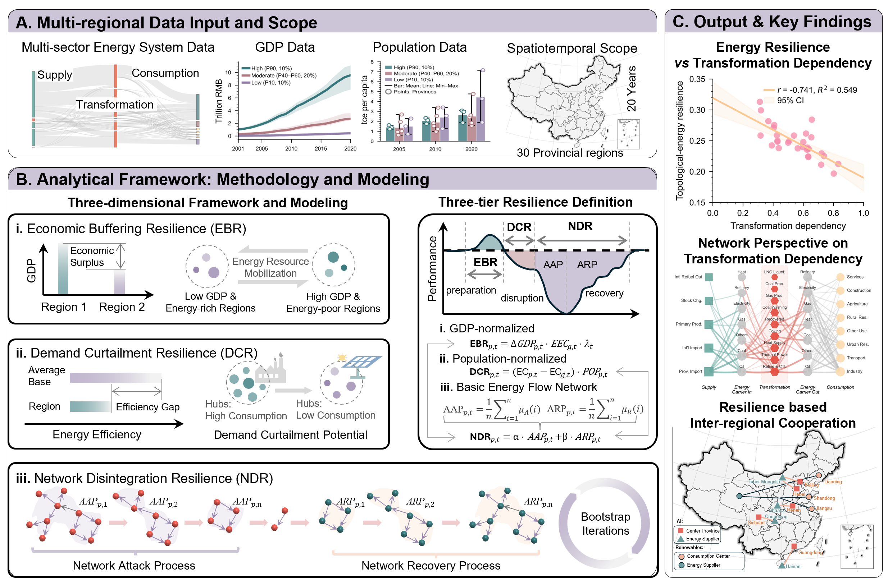

# Spatiotemporal Assessment of Provincial Energy Resilience in China

**A Three-Dimensional Framework Based on Graph Theory**

This repository contains the open-source code for the research paper *"Spatiotemporal Assessment of Provincial Energy Resilience in China: A Three-Dimensional Framework Based on Graph Theory"*.

## Research Framework

The framework quantifies energy resilience through three dimensions mapped to three network representations of provincial energy systems:



- **Economic Buffering Resilience (EBR)** — capacity to mobilize economic resources for energy procurement during disruptions, derived from a GDP-normalized derivative network.
- **Demand Curtailment Resilience (DCR)** — compressible load margin available through managed demand-side curtailment, derived from a population-normalized derivative network.
- **Network Disintegration Resilience (NDR)** — intrinsic topological robustness of the energy flow network under cascading failure, assessed via full-trajectory bootstrap simulation on the base energy flow network.

A novel **transformation dependency** index (*tau*) is introduced to quantify the fraction of total energy supply that must transit intermediate transformation nodes, serving as the dominant structural predictor of resilience.

## Key Findings

- **Resilience-economy inversion**: Coastal economic hubs are economically robust but structurally fragile; inland energy-exporting provinces achieve ~10.6% higher NDR despite limited economic resources.
- **Transformation dependency** alone accounts for over half of cross-provincial resilience variance (R² = 0.549), a signal that conventional supply diversity metrics (Shannon Entropy, HHI) cannot detect.
- **Network-level resource curse**: Energy-exporting provinces lost 27.3% NDR between 2010–2020 due to export-oriented specialization, while importing regions gained 6.8%.
- **Inter-regional coordination**: The framework independently validates 50% of nationally planned AI data center hubs and identifies three previously unrecognized strategic energy corridors.

## Study Scope

| Parameter     | Coverage                                                                           |
| ------------- | ---------------------------------------------------------------------------------- |
| Spatial       | 30 provincial-level regions in mainland China                                      |
| Temporal      | 2001–2020 (600 province-year observations)                                         |
| Data sources  | China Energy Statistical Yearbook; National Bureau of Statistics (GDP, population) |
| Network scale | ~50–60 nodes per province, several hundred directed weighted edges                 |

Six grid regions are analyzed: North China, Northeast, East China, Central China, Northwest, and South China.

## Project Structure

```
Urban-energy-resilience/
├── config/                   # Configuration (config.yaml)
├── data/
│   ├── raw/                  # Input data (energy balance tables, GDP, population)
│   └── processed/            # Preprocessed intermediate data
├── src/
│   ├── preprocessing/        # Network construction from energy balance tables
│   ├── network_analysis/     # Structural metrics (CI, NCI, Shannon, HHI)
│   ├── resilience/           # Three-dimensional resilience computation
│   │   ├── level1_economy.py     # EBR: economic buffering
│   │   ├── level2_population.py  # DCR: demand curtailment
│   │   └── level3_structure.py   # NDR: network disintegration
│   ├── attack_simulation/    # Bootstrap cascading failure simulation
│   ├── validation/           # Data integrity checks
│   └── visualization/        # Spatial maps, Sankey diagrams, plots
├── scripts/
│   ├── run_pipeline.py       # End-to-end analysis pipeline
│   └── visualize_results.py  # Figure generation
├── outputs/                  # Generated figures, tables, results
├── notebooks/                # Exploratory analysis
├── docs/                     # Documentation and figures
└── tests/                    # Unit tests
```

## Getting Started

### Prerequisites

- Python 3.8+
- See `requirements.txt` for package dependencies (NetworkX, NumPy, Pandas, Matplotlib, etc.)

### Installation

```bash
git clone https://github.com/<username>/Urban-energy-resilience.git
cd Urban-energy-resilience

python -m venv venv
# Windows:
venv\Scripts\activate
# Linux/Mac:
source venv/bin/activate

pip install -r requirements.txt
```

### Data Preparation

Place input data files in `data/raw/`:

- Provincial energy balance tables (from China Energy Statistical Yearbook)
- GDP and population data (from National Bureau of Statistics)

### Running the Analysis

```bash
# Full pipeline
python scripts/run_pipeline.py --level all

# Individual dimensions
python scripts/run_pipeline.py --level 1   # EBR only
python scripts/run_pipeline.py --level 2   # DCR only
python scripts/run_pipeline.py --level 3   # NDR only (bootstrap simulation)
```

The NDR computation uses parallel bootstrap simulation (default: 1000 iterations, 16 threads). Adjust `n_processes` and `n_simulations` in `config/config.yaml`.

## Core Methodology

### Network Construction

Each province-year is modeled as a directed weighted graph G = (V, E) with five node types: supply, energy carrier, transformation, consumption, and loss. Edge weights represent energy flows in 10,000 tce. Two derivative networks are generated by normalizing edge weights by GDP and population, respectively.

### Bootstrap Cascading Failure

For NDR computation, random sequential edge removal with recursive downstream flow propagation simulates cascading failures. 1000 bootstrap iterations produce attack and recovery trajectories, from which Average Attack Performance (AAP) and Average Recovery Performance (ARP) are derived.

### Inter-regional Coordination

The framework identifies:

1. **AI data center candidates** — provinces with high EBR and resilient supply neighborhoods
2. **Firm energy contracts** — pairing high-NDR suppliers with high-EBR demanders
3. **Non-firm energy contracts** — pairing high-NDR suppliers with high-DCR demanders

## Citation

If you use this code, please contact the authors for citation details.

For any questions regarding code details, please contact the author.

132goodhao@gmail.com

## License

This project is for academic research purposes.
